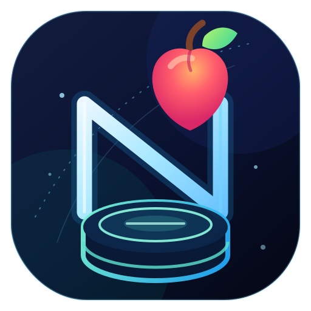

<p align="center">
  
</p>

<h1 align="center">NewtonDB</h1>

<p align="center"><strong>A tiny JSON database with unusually serious correctness.</strong></p>

<p align="center">
  Typed collections · immutable reads · serializable queries · atomic transactions · honest durability
</p>

<p align="center">
  <a href="https://www.npmjs.com/package/newtondb"></a>
  <a href="https://github.com/alexberriman/newtondb/actions/workflows/ci.yml"></a>
  <a href="LICENSE"></a>
</p>

NewtonDB is an embedded, TypeScript-native document database for applications whose working set fits in memory. It has no runtime dependencies and no server to operate. The core is platform-neutral; `newtondb/node` adds a crash-qualified JSON-file adapter for Linux local filesystems.

This is a clean semantic-major redesign. It chooses a narrow contract and proves it with property models, transaction histories, named fault injection, real process-death recovery, API snapshots, package-consumer tests, mutation checks, and controlled benchmarks.

## Install

```sh
npm install newtondb
```

NewtonDB is ESM-only and supports Node `^22.13.0` and maintained Node 24+ releases.

## Sixty-second start

```ts
import { Database, collectionSchema, where } from "newtondb";

type Planet = {
  id: string;
  kind: "gas" | "rocky";
  moons: number;
};

const schema = {
  planets: collectionSchema<Planet>({
    primaryKey: "id",
    indexes: [{ name: "by-kind", path: ["kind"] }],
  }),
};

const db = Database.memory(
  {
    planets: [
      { id: "earth", kind: "rocky", moons: 1 },
      { id: "saturn", kind: "gas", moons: 146 },
    ],
  },
  { schema },
);

const rocky = db
  .collection("planets")
  .findMany(where<Planet>().eq("kind", "rocky"));
// readonly [{ id: "earth", kind: "rocky", moons: 1 }]

await db.collection("planets").update("earth", { moons: 2 });
```

Returned documents and arrays are recursively frozen snapshots. Input data is cloned and validated, so application mutation cannot silently corrupt keys or indexes.

## Atomic transactions

```ts
const receipt = await db.transaction((tx) => {
  tx.collection("planets").update("earth", { moons: 1 });
  tx.collection("planets").insert({ id: "mars", kind: "rocky", moons: 2 });
});

console.log(receipt.revision, receipt.affected, receipt.durability);
```

Transactions are collection-granular serializable and publish one immutable root. The callback must be synchronous. A conflicting revision rejects without exposing partial records, index changes, revisions, or events.

## Durable file storage

```ts
import { Database } from "newtondb";
import { JsonFileAdapter } from "newtondb/node";

const db = await Database.open({
  adapter: new JsonFileAdapter("./data/app.json", {
    createDirectories: true,
  }),
  initialData: { planets: [] },
  schema,
});

const receipt = await db.collection("planets").insert({
  id: "neptune",
  kind: "gas",
  moons: 16,
});

console.log(receipt.durability); // "persisted"
await db.close();
```

The file adapter locks before load, validates a versioned checksummed envelope, writes and syncs a unique same-directory temporary file, atomically renames it, and syncs the directory. A persisted receipt means storage acknowledged at least that revision.

If persistence fails after publication, the database becomes degraded and throws `PersistenceError` with the already committed receipt. Do not retry the application transaction; call `flush()` to retry persistence.

## Queries that remain data

```ts
const condition = where<Planet>().and(
  where<Planet>().eq("kind", "gas"),
  where<Planet>().gte("moons", 10),
);

const wire = JSON.stringify(condition);
const restored = JSON.parse(wire);

const result = db
  .collection("planets")
  .query(restored)
  .orderBy("moons", "desc")
  .limit(10)
  .toArray();
```

The versioned grammar contains no regex or arbitrary serializable functions. Values are not coerced. The parser and executor enforce depth, node, byte, candidate, result, sort, set, and ordering limits. Equality uses a primary or declared secondary index when possible and otherwise performs a bounded scan.

## Generated keys and events

```ts
const generated = collectionSchema<{ id: string; text: string }>({
  primaryKey: "id",
  generatePrimaryKey: true,
});

const withEvents = Database.memory(
  { notes: [] as { id: string; text: string }[] },
  {
    schema: { notes: generated },
    eventDocuments: "include", // opt in; omitted by default
  },
);

const unsubscribe = withEvents.subscribe((batch) => {
  console.log(batch.revision, batch.changes);
});

const commit = await withEvents.collection("notes").insert({ text: "gravity" });
console.log(commit.generatedKeys[0]?.primaryKey);
unsubscribe();
```

Events are revision-ordered and at-most-once in memory. Listener and diagnostic failures cannot alter commit outcome. They are not a durable queue.

## What NewtonDB guarantees

- Plain, bounded JSON enters; detached frozen JSON leaves.
- String and safe-integer key domains cannot collide; primary keys never mutate.
- Declared unique/index constraints and collection revisions change atomically.
- Index and scan plans share one evaluator and deterministic result ordering.
- Memory and persisted durability are explicit in every commit receipt.
- Cooperative writers conflict safely; storage identity/generation/revision are checked.
- A process crash during any maintained replacement boundary recovers a complete old or new snapshot.
- The packed ESM artifact, declarations, exports, licenses, API reports, and build manifest are verified in CI.

## Deliberate boundaries

- The database and indexes fit in memory. The measured reference envelope is 100,000 records / 11.2 MB canonical JSON on the recorded Node 24/Linux ARM64 profile.
- File crash safety is qualified only on Linux local filesystems with atomic same-directory rename and working file/directory sync.
- Locks coordinate cooperative writers. Directory ACLs—not lock JSON or SHA-256—defend against a malicious same-user process.
- Checksums detect accidental corruption; they do not authenticate files or prevent rollback.
- Browser use, CommonJS, SQL, joins, replication, caching, regex queries, ordered indexes, cursor pagination, durable events, and deep imports are unsupported.
- Validators, local predicates, listeners, custom adapters, and JavaScript proxies are trusted application code.

## Documentation

| Guide                                                      | Covers                                                     |
| ---------------------------------------------------------- | ---------------------------------------------------------- |
| [Architecture](docs/architecture.md)                       | roots, overlays, indexes, planner, persistence             |
| [JSON and schemas](docs/data-and-schema.md)                | accepted values, paths, keys, hard ceilings                |
| [Queries](docs/queries.md)                                 | grammar, truth tables, plans, complexity, limits           |
| [Transactions and events](docs/transactions-and-events.md) | isolation, receipts, conflicts, privacy                    |
| [Durability and recovery](docs/durability-and-recovery.md) | file guarantees, degraded state, restore workflow          |
| [Adapter authoring](docs/adapters.md)                      | structural contract and conformance tools                  |
| [Errors](docs/errors.md)                                   | stable codes and safe handling                             |
| [Snapshot format](docs/storage-format.md)                  | envelope, version window, format evolution                 |
| [Security](docs/security.md)                               | threat model, trust boundaries, denial-of-service controls |
| [Support](docs/support.md)                                 | runtimes, platforms, scale, unsupported surfaces           |
| [Performance](docs/project/performance.md)                 | deterministic methodology and measured envelope            |
| [API reference](docs/api/index.html)                       | generated from the tested public surface                   |

Runnable examples cover [memory](examples/memory.mjs), [transactions](examples/transactions.mjs), [query serialization](examples/query-serialization.mjs), [custom adapters](examples/custom-adapter.mjs), [durable files](examples/durable-file.mjs), and [verified recovery](examples/recovery.mjs). CI installs the packed tarball and executes every one.

## Project

Contributions are welcome through [the engineering guide](CONTRIBUTING.md). Please report vulnerabilities privately using [the security policy](SECURITY.md). Releases follow the [changelog policy](docs/changelog-policy.md) and [maintainer runbook](docs/releasing.md).

MIT © Alex Berriman
